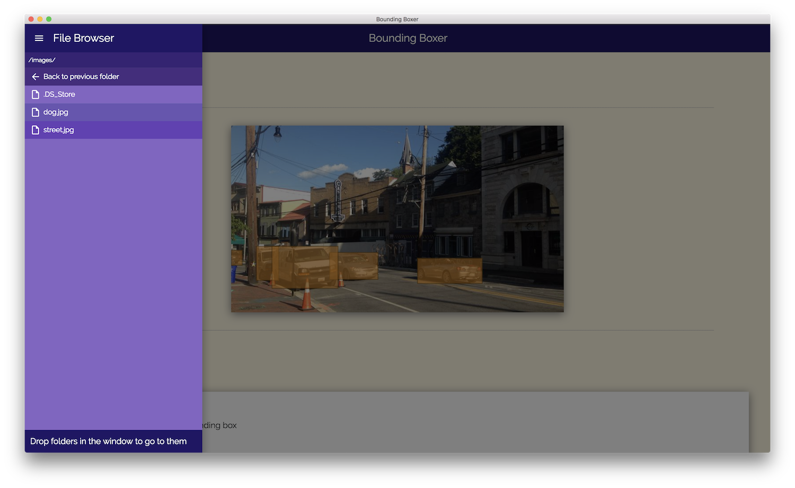
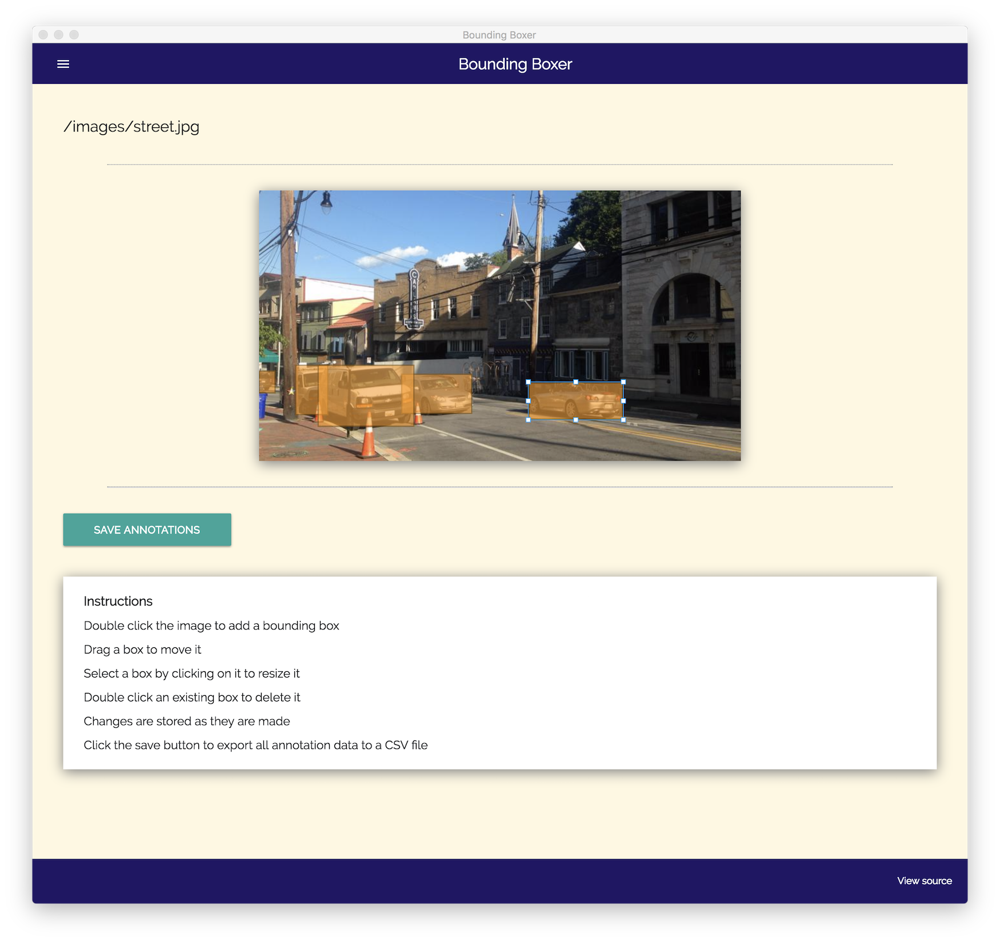
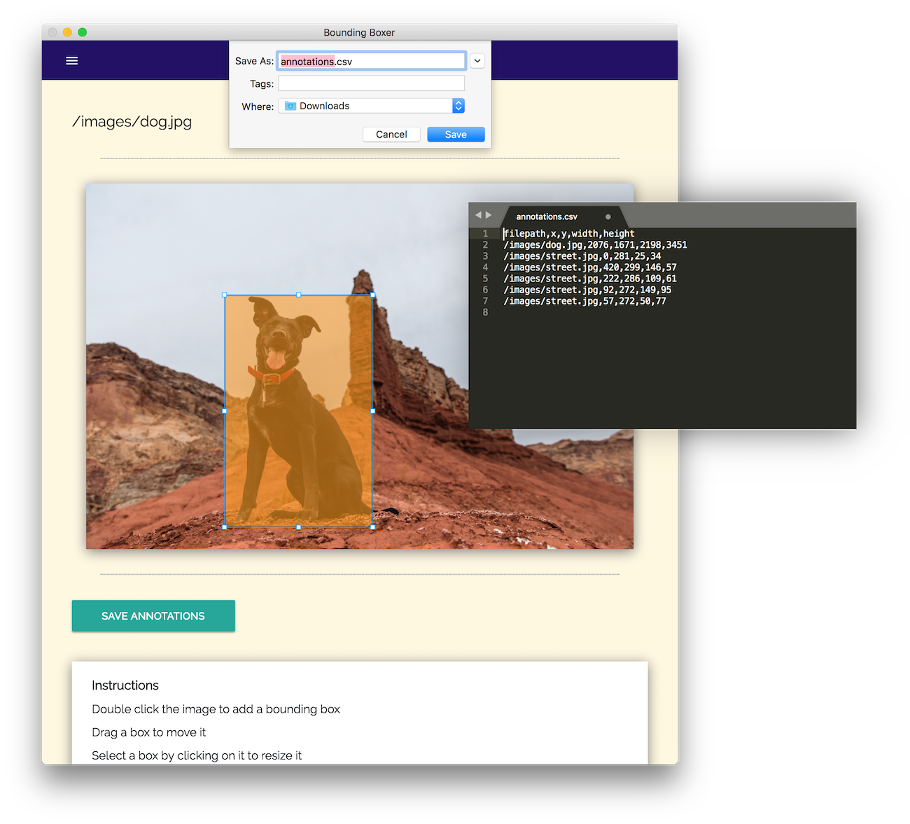

# Bounding Boxer

Bounding boxer is a desktop app that allows you to draw boxes on images to create
a data set of images annotated with bounding boxes.  Annotations can then be saved to a CSV.

Built using Electron, React, NeDB, and Konva

## Screenshots

##### Select images in the file browser


##### Draw boxes around objects of interest


##### Save bounding boxes to a CSV


## Development

This app runs on Node 8+

### Install

```sh
git clone https://github.com/Ben-Wu/Artist-Pathfinder.git
yarn
```

### Build and Run

```sh
yarn start
```

### Make release

```sh
yarn build
```

Output files will be in `/dist`
